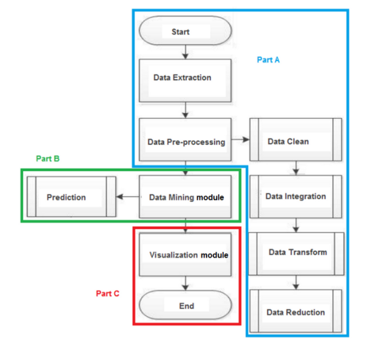
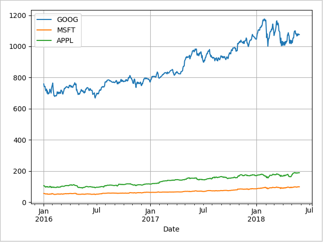
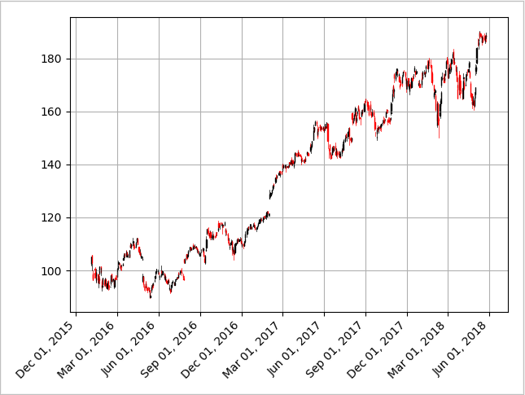
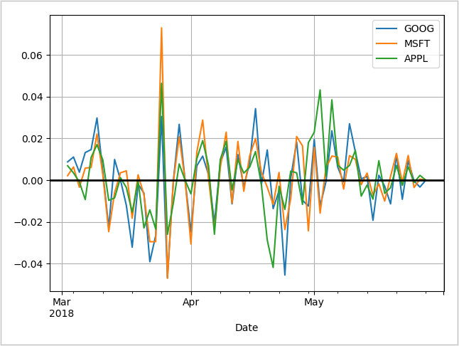
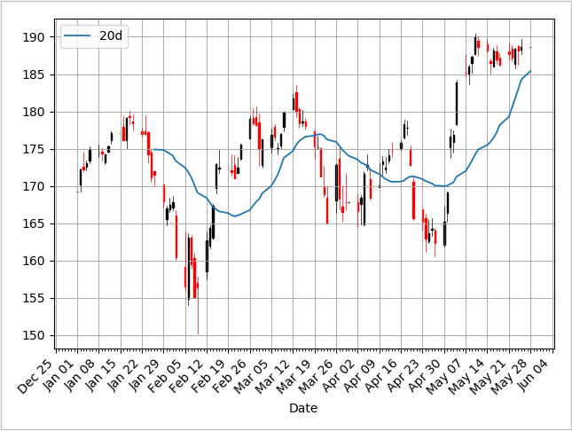
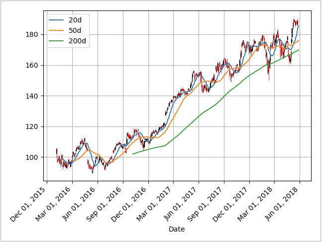
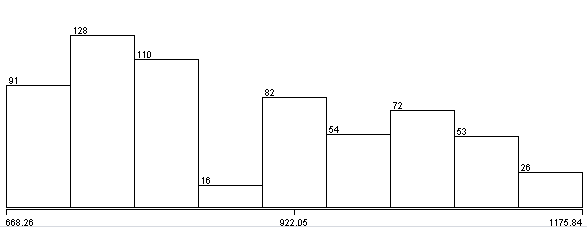
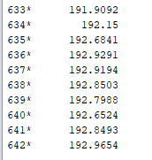
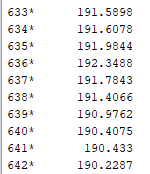
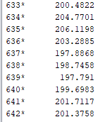

## Introduction
I finally finish one of my dream this year to play with some codes in stock indexes estimation. In January to Martch I made some literature research for a wide-used hidden markov - stochastic volatility models, see [Literature Research](https://github.com/XinyiLeo/Samples/blob/master/Xinyi%20Wu_433%20final%20report.pdf). Later in Machine learning course, I used software like Weka to give some baseline predictions and finally understood and revised some codes in HMM stock prediction. This is my first ML project in finance. Regard it as prototype, because it is far from mature to put in to reality algo trading. 

## Background
I myself firmly believe that algorithms is the core backbone of trading strategy, despite that human operations like legal policies and government regulation can push the stock up and down some time. The essence and charisma of machine learning algorithms will apparently stand out in high frequency trading (HFT). HFT aims to do quantitative trading by designing algorithm to buy or sell a product in a very transient time period that mostly cannot be realized by human beings. The profit of a buy/sell is very little, but we do millions of trading within a day. So the profit summed up is observable.

I used python3 to implemet codes and visualize data. I revised some codes in HMM. Those codes are for education purpose, but I revised them in my financial projects. My revised codes are here [My codes](https://github.com/XinyiLeo/StockHMM). 

The process of my work is similiar to this flow chart. First, I analysed some significant feaures in stock estimation. For example, log return and moving averages. Second, I used some popular regression methods to make simple estimations and serve the results as baseline method. It's noted that the baseline method performs similarly except the basic Gaussian Method. Last I followed the tutorial of GaussianHMM package to simulate the Baum-Welch training, and calculate the hidden layes of the stock indexes. I simplified the validation process. Instead of using MAP(Maximum a posteriori estimation), I simply compared the result of HMM with those baseline results from Weka. 



## Visualization for historical data
Those are visualization of three close values: Apple Inc. (NASDAQ:AAPL), Microsoft (NASDAQ:MSFT) and Google (NASDAQ:GOOG), from 2016 January to 2018 June. 


I extracted data from Morningstar Investment management company, because it has high compatibility with pandas in python. The current inputs are extracted from historical financial time series data, which includes: 
1. Daily Open: the price of the stock at the beginning of the trading day (it need not be the closing price of the previous trading day).
2. Daily High: the highest price of the stock on that trading day.
3. Daily Low: the lowest price of the stock on that trading day, and close the price of the stock at closing time.
4. Adjusted close: the closing price of the stock that adjusts the price of the stock for corporate actions.

A good way to visualize all data is by Candlestick Chart. In this chart. If the daily open value is lower than the close value, the bar is black (reported a gain). If the daily close value is higher than the open value, the bar is red (reported a loss). The wicks on the top and lower part of the bar means the high value and low value of a day.  
 
 
In finance, we concerned about the relative change of an asset rather than its absolute price. That’s because when we trade, we concern more about the volatility of a stock price.


Log return is a much more useful plot. We can now see how profitable each stock was since the beginning of the period. Furthermore, we see that these stocks are highly correlated; they generally move in the same direction, a fact that was difficult to see in the other charts. 



Another possible feature for stock estimation is Moving Average,  
<a href="https://www.codecogs.com/eqnedit.php?latex=MA_t^q&space;=&space;\dfrac{1}{q}&space;\sum\limits_{i=0}^{q-1}&space;x_{t-i}" target="_blank"></a>

Moving averages smooth a series and helps identify trends, and help identify trends from “noise”. 



Here, the 200-day moving average shows that the stock is trending downward over ina general view. 
Also the crossing of moving average lines indicate changes in trend, which can be used as trading signals, or indications that a financial security is changing direction and a profitable trade might be made.




## Weka Baseline Estimation 
First I installed package Time Series Forecasting. The Regression Techniques I used:
* Linear: conditional mean of y is a linear affine function of x.
* Multilayer Perception: Feed forward artificial neural network.
* MLP can also differentiate data which cannot be separated linearly.
* SMOreg: Support Vector Regression Method, use sequential minimal optimization algorithm.

Data Collection: Used python to generate two csv files: 
Weka automaticlaly generate statistics (take Google (NASDAQ: GOOG) close value from 2016 Jan. 1st, to 2018 May 25th as an example):




I used those methods above to forecast the result of GOOG stock index 10 days after: 
1. Simple Gaussian Process Predictor (not fit)


2. Linear Regression (Intuitive Method)




3. Multilayer Perception




4. SMOreg


5. HoltWinters (I don't what that is, but fancy enough to try):




Except Gaussian method, all the other perform tolerable results.

## Hmmlearn Package
For those who have problem installing hmmlearn, I provide the wheel executable here  [HMMwheel](https://www.lfd.uci.edu/~gohlke/pythonlibs/). It does not appears on official website and it takes a while to find this.

The reason of using HMM is that based on observations, we predict that the hidden states are some Gaussian Distrbutions with different parameters. We don't know the exact number of hidden states, so I assume 4 states (simplified model).

### Model Description

<a href="https://www.codecogs.com/eqnedit.php?latex=\lambda&space;=&space;(\pi,&space;A,&space;B)" target="_blank"></a>
where A is the transition matrix, B is the matrix of observation, where

<a href="https://www.codecogs.com/eqnedit.php?latex=b_j(Q_t)&space;=&space;\sum\limits_{m=1}^M&space;c_{jm}N(O_t,&space;\mu_{jm},&space;\Sigma_{jm})" target="_blank"></a>
 
* M is number of Gaussian Mixture Components
* c_jm is the weight of m mixture component in state j
* \mu _jm is the mean vector of mth component in jth state
* N() is multi-dimensional Gaussian Distribution
In my simulation, I choose observation to be the log return of the stock. I set hidden states to 4. And I acquire data from Morningstar Company.I posted a code for training, which is partly referred by the tutorial of hmmlearn package.
```
    import datetime
    import numpy as np
    from matplotlib import cm, pyplot as plt
    from matplotlib.dates import YearLocator, MonthLocator
    from hmmlearn.hmm import GaussianHMM
    from sklearn.preprocessing import scale
    import pandas_datareader.data as web

    start = datetime.datetime(2016, 1, 1)
    end = datetime.date.today()
    apple = web.DataReader("AAPL", "morningstar", start, end)

    dates = np.array(apple["Close"].index.levels[1])
    close_v = np.array(apple["Close"].values)
    volume = np.array(apple["Volume"].values)[1:]

    # Get the variation of the price
    diff = np.diff(close_v)
    dates = dates[1:]
    close_v = close_v[1:]

    # Scale: Normalize
    # Input the stock return and
    X = np.column_stack([scale(diff), scale(volume)])

    # Train Gaussian Model, Assume 4 hidden states
    model = GaussianHMM(n_components=4, covariance_type="full", n_iter=20)
    model.fit(X)

    # Prediction the hidden layers
    hidden_states = model.predict(X)
```


